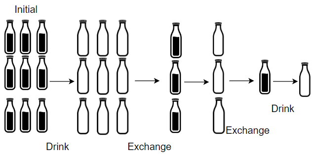
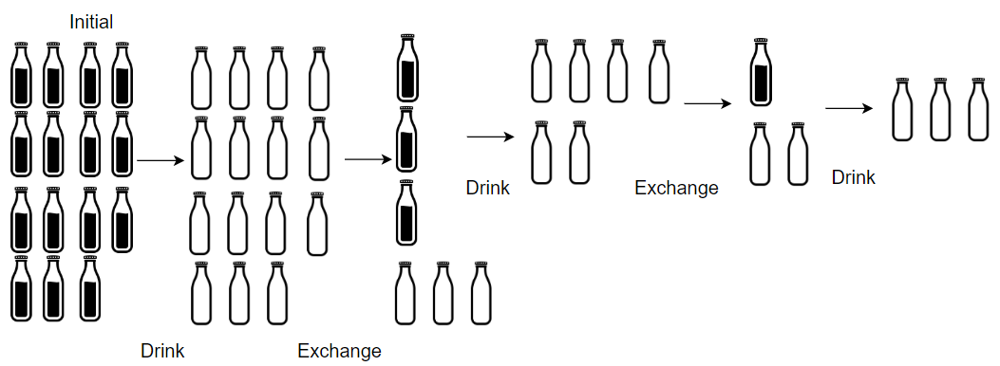

# Water Bottles
There are `numBottles` water bottles that are initially full of water. You can exchange `numExchange` empty water bottles from the market with one full water bottle.

The operation of drinking a full water bottle turns it into an empty bottle.

Given the two integers `numBottles` and `numExchange`, return the **maximum number of water bottles you can drink**.

## Examples

*   **Example 1:**
    *   Input: `numBottles = 9`, `numExchange = 3`
    *   Output: `13`
    *   Explanation: You can exchange 3 empty bottles to get 1 full water bottle.
        Number of water bottles you can drink: 9 + 3 + 1 = 13.

*   **Example 2:**
    *   Input: `numBottles = 15`, `numExchange = 4`
    *   Output: `19`
    *   Explanation: You can exchange 4 empty bottles to get 1 full water bottle.
        Number of water bottles you can drink: 15 + 3 + 1 = 19.

## Constraints

*   `1 <= numBottles <= 100`
*   `2 <= numExchange <= 100`

### Time Complexity

*   The time complexity of this algorithm is **O(log(n))** where n is the number of bottles initially given. This is because the algorithm is a while loop that continues until the number of bottles is zero. The number of iterations is proportional to the number of times the number of bottles can be divided by the number of bottles needed to exchange for one full water bottle. Therefore, the time complexity is logarithmic.

### Space Complexity

*   The space complexity of this algorithm is **O(1)** since the algorithm only uses a constant amount of space to store the variables such as the maximum number of bottles, the number of new bottles and the remaining bottles. The space complexity is independent of the size of the input and hence is constant.

