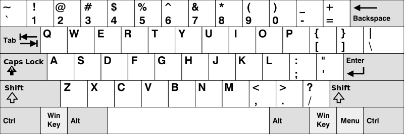

# Find Words

## Problem Description

Given an array of strings `words`, return the words that can be typed using letters of the alphabet on only one row of American keyboard like the image below.

**Note** that the strings are case-insensitive, both lowercased and uppercased of the same letter are treated as if they are at the same row.

## American Keyboard Layout

The American keyboard layout consists of the following rows:

* The first row consists of the characters "qwertyuiop".
* The second row consists of the characters "asdfghjkl".
* The third row consists of the characters "zxcvbnm".

## Examples

### Example 1

* Input: `words = ["Hello","Alaska","Dad","Peace"]`
* Output: `["Alaska","Dad"]`
* Explanation: Both "a" and "A" are in the 2nd row of the American keyboard due to case insensitivity.

### Example 2

* Input: `words = ["omk"]`
* Output: `[]`

### Example 3

* Input: `words = ["adsdf","sfd"]`
* Output: `["adsdf","sfd"]`

## Constraints

* 1 <= `words.length` <= 20
* 1 <= `words[i].length` <= 100
* `words[i]` consists of English letters (both lowercase and uppercase).

### Time Complexity

The time complexity of the `findWords` method is O(n * m), where n is the number of words in the input array and m is the average length of the words. This is because for each word, we iterate through its characters to determine if they all belong to the same keyboard row, which takes O(m) time.

### Space Complexity

The space complexity is O(n + m), where n is the space needed to store the result list of words that can be typed using one row, and m is the space used by the set of unique letters for each word during processing.
