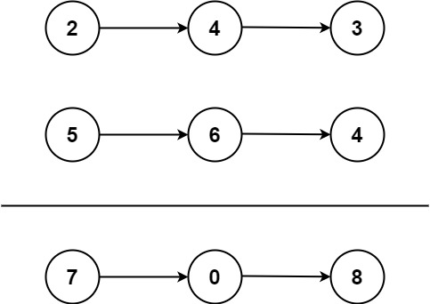

# Add Two Numbers

You are given two non-empty linked lists representing two non-negative integers. The digits are stored in reverse order, and each of their nodes contains a single digit. Add the two numbers and return the sum as a linked list.

You may assume the two numbers do not contain any leading zero, except the number 0 itself.

## Example 1

- Input: `l1 = [2,4,3]` , `l2 = [5,6,4]`
- Output: `[7,0,8]`
- Explanation: `342` + `465` = `807`.

## Example 2

- Input: `l1 = [9,9,9,9,9,9,9]` , `l2 = [9,9,9,9]`
- Output: `[8,9,9,9,0,0,0,1]`

## Constraints

- The number of nodes in each linked list is in the range `[1, 100]`.
- `0` <= `Node.val` <= `9`
- It is guaranteed that the list represents a number that does not have leading zeros.

## Time Complexity

The time complexity of the code is O(max(m, n)) where m and n are the lengths of the two linked lists. This is because the code iterates through the two lists once.

## Space Complexity

The space complexity of the code is O(max(m, n)) as well. This is because the code creates a new linked list with the same length as the longer of the two input linked lists.
