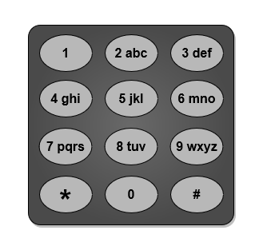
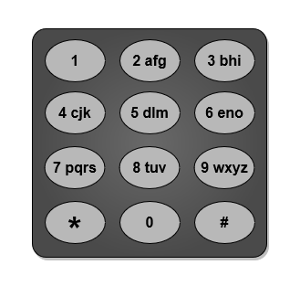
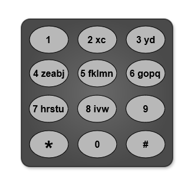
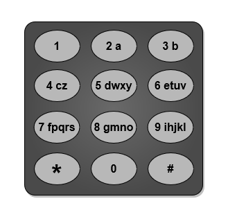

# Minimum Number of Pushes

You are given a string `word` containing lowercase English letters.

Telephone keypads have keys mapped with distinct collections of lowercase English letters. These keys can be used to form words by pressing them. For example:
- Key 2 is mapped with `["a", "b", "c"]`.
  - Push the key once to type "a".
  - Push the key twice to type "b".
  - Push the key three times to type "c".

It is allowed to remap the keys numbered 2 to 9 to distinct collections of letters. The keys can be remapped to any number of letters, but each letter must be mapped to exactly one key. You need to find the **minimum number of times** the keys will be pushed to type the string `word`.

**Objective**: Return the minimum number of pushes needed to type `word` after remapping the keys.

---

## Example Mappings

An example mapping of letters to keys on a telephone keypad is given below. Note that keys 1, *, #, and 0 do not map to any letters.

---

## Examples

### Example 1

- **Input**: `word = "abcde"`
- **Output**: `5`
- **Explanation**:
  - Remapped keypad provides the minimum cost.
  - "a" -> one push on key 2
  - "b" -> one push on key 3
  - "c" -> one push on key 4
  - "d" -> one push on key 5
  - "e" -> one push on key 6
  - **Total cost**: 1 + 1 + 1 + 1 + 1 = 5
  - No other mapping can provide a lower cost.

### Example 2

- **Input**: `word = "xyzxyzxyzxyz"`
- **Output**: `12`
- **Explanation**:
  - Remapped keypad provides the minimum cost.
  - "x" -> one push on key 2
  - "y" -> one push on key 3
  - "z" -> one push on key 4
  - **Total cost**: 1 * 4 + 1 * 4 + 1 * 4 = 12
  - No other mapping can provide a lower cost.
  - Note: Key 9 is not mapped to any letter.

### Example 3

- **Input**: `word = "aabbccddeeffgghhiiiiii"`
- **Output**: `24`
- **Explanation**:
  - Remapped keypad provides the minimum cost.
  - "a" -> one push on key 2
  - "b" -> one push on key 3
  - "c" -> one push on key 4
  - "d" -> one push on key 5
  - "e" -> one push on key 6
  - "f" -> one push on key 7
  - "g" -> one push on key 8
  - "h" -> two pushes on key 9
  - "i" -> one push on key 9
  - **Total cost**: 1 * 2 + 1 * 2 + 1 * 2 + 1 * 2 + 1 * 2 + 1 * 2 + 1 * 2 + 2 * 2 + 6 * 1 = 24
  - No other mapping can provide a lower cost.

---

## Constraints

- `1 <= word.length <= 10^5`
- `word` consists of lowercase English letters.

## Time and Space Complexity Analysis

### Time Complexity

The time complexity of this algorithm is O(n log n) as it needs to traverse the arrays until the number becomes 0. The number of operations performed is proportional to the number of elements in the arrays. The log n factor is due to the sorting of the arrays.

### Space Complexity

The space complexity of this algorithm is O(1) as the space required does not change with the size of the input. The space required is constant and is used to store the arrays and the result string.
