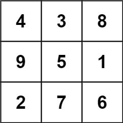
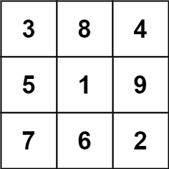

# Magic Square

A 3 x 3 magic square is a 3 x 3 grid filled with distinct numbers from 1 to 9 such that each row, column, and both diagonals all have the same sum.

## Problem Statement

Given a row x col grid of integers, how many 3 x 3 magic square subgrids are there?

While a magic square can only contain numbers from 1 to 9, grid may contain numbers up to 15.

## Example
- **Input:** grid = `[[4,3,8,4],[9,5,1,9],[2,7,6,2]]`
- **Output:** `1`
- **Explanation:**
  - The following subgrid is a 3 x 3 magic square:
    - 
  - While this one is not:
    - 
  - In total, there is only **one magic square** inside the given grid.

## Constraints

* **row** == grid.length
* **col** == grid[i].length
* 1 <= **row**, **col** <= 10
* 0 <= grid[i][j] <= 15

## Time Complexity Analysis

* The time complexity of the algorithm is O(n^2), where n is the number of rows (or columns) in the grid.
* This is because we are iterating over all possible 3x3 subgrids in the given grid, and for each subgrid, we are checking if it's a magic square by iterating over its cells.

## Space Complexity Analysis

* The space complexity of the algorithm is O(1), which means that the algorithm uses constant space.
* This is because we are only using a fixed amount of space to store the counts of magic squares and the seen elements, regardless of the size of the input grid.
